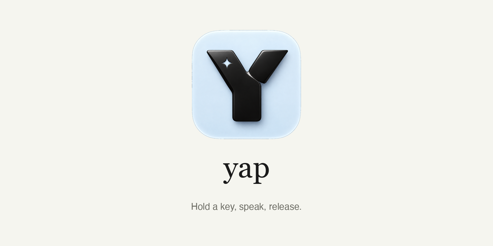
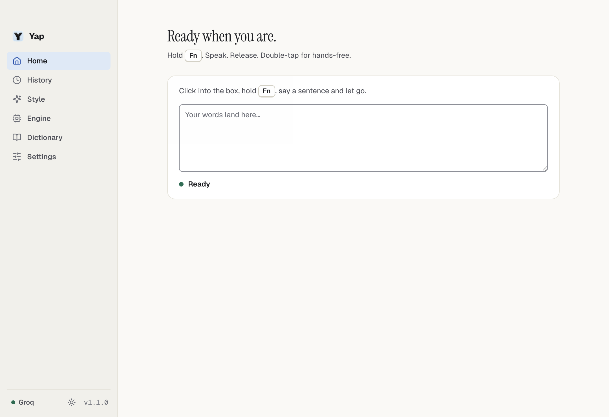
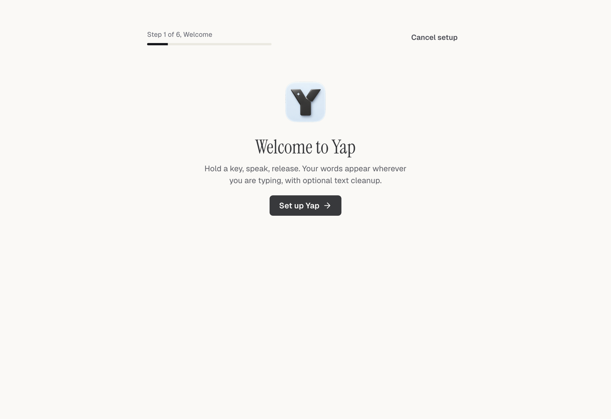
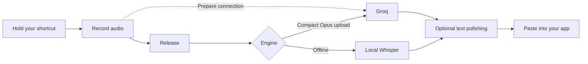
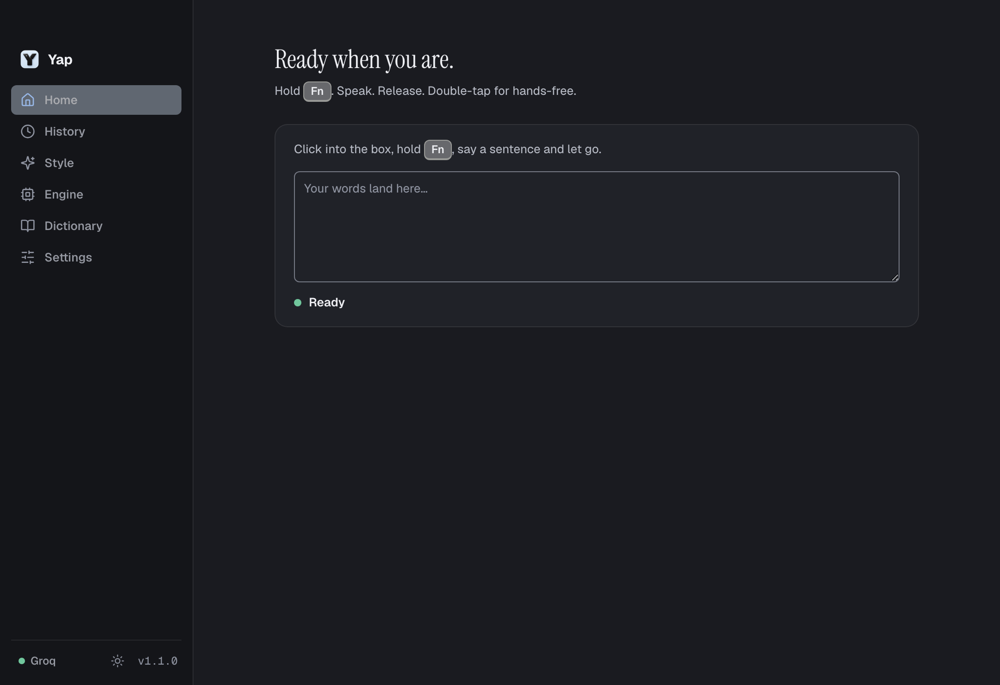

<p align="center">
  
</p>

<h1 align="center">Your voice. Your apps. No subscription.</h1>

<p align="center">
  <strong>Yap is a free, open source alternative to Wispr Flow and other desktop dictation apps.</strong><br />
  Hold a key, speak naturally, and let your words land where your cursor is.<br />
  Fast Groq APIs when you want speed. Local Whisper when you want offline transcription.
</p>

<p align="center">
  <a href="LICENSE"></a>
  <a href="https://github.com/nicremo/yap/actions/workflows/ci.yml"></a>
  <a href="package.json"></a>
  
  
</p>

<p align="center">
  <a href="#get-started">Get started</a> ·
  <a href="#why-yap">Why Yap</a> ·
  <a href="#fast-by-design">How it stays fast</a> ·
  <a href="docs/PRIVACY.md">Privacy</a> ·
  <a href="CONTRIBUTING.md">Contribute</a>
</p>



<p align="center"><sub>The real app renderer, captured with a clean demo profile. No personal dictations, API keys or invented speed results.</sub></p>

## Why Yap

Dictation should be something you can use, inspect and make your own.

- **Free and open source.** MIT licensed. No Yap subscription, paid feature gate or Yap account.
- **Type with your voice across apps.** Hold your shortcut to talk and release to paste. Double tap for hands-free dictation.
- **Fast cloud transcription.** Groq runs Whisper Large v3 or Large v3 Turbo, with optional text cleanup through its language models.
- **An offline option.** Run Whisper Base or Small on your own computer after the initial model download. Leave cloud polishing off to keep dictation local.
- **Your words, your style.** Conversation and coding styles, custom instructions, a personal dictionary, corrections and per-app rules.
- **A clipboard that stays yours.** Automatic paste restores the previous clipboard by default. Keep dictated text on it only when you choose to.
- **English and German interface.** Light, dark and system appearance. Dictation language is configured separately from the interface.
- **Visible timing.** The app reports transcription, cleanup and delivery timing for your own dictations.

Yap is an independent project. It is not affiliated with Wispr Flow, Superwhisper or Groq. It offers the core desktop dictation workflow; it does not claim feature-for-feature parity with every competing product.

## Free means free software

**Yap itself costs nothing.** Every feature in this repository is included, and you can modify or redistribute the app under the MIT license.

| Mode | What you need | Cost and data flow |
| --- | --- | --- |
| Groq cloud | Your own Groq account and API key | Can run on Groq's free tier within its limits. Audio is sent directly to Groq. Paid API plans can incur charges. |
| Local Whisper | Download a Base or Small model once | No API bill for transcription. Runs on your computer after the model download. |
| Optional cloud polishing | Your Groq key | Sends the transcript and style instructions to Groq, including when enabled alongside local transcription. |

Groq controls its [free-tier limits](https://console.groq.com/docs/rate-limits), model availability and [speech-to-text pricing](https://console.groq.com/docs/speech-to-text). Those can change. Yap does not promise unlimited third-party API usage.

## Get started

Download the latest app directly from [GitHub Releases](https://github.com/nicremo/yap/releases/latest):

| Platform | Download | Install |
| --- | --- | --- |
| macOS, Apple Silicon | [Download the Apple Silicon installer](https://github.com/nicremo/yap/releases/download/v1.1.1/Yap-1.1.1-arm64.dmg) | Open the DMG and drag Yap into Applications. |
| macOS, Intel | [Download the Intel installer](https://github.com/nicremo/yap/releases/download/v1.1.1/Yap-1.1.1-x64.dmg) | Open the DMG and drag Yap into Applications. |
| Windows, x64 | [Download the Windows installer](https://github.com/nicremo/yap/releases/download/v1.1.1/Yap-1.1.1-setup.exe) | Run the setup installer. |

macOS builds are signed but not notarized by Apple. Windows builds are not Authenticode signed. Your operating system may show a warning for a downloaded app. See the release notes for platform-specific installation guidance.

The setup wizard walks you through the engine, permissions and shortcut. Groq mode uses your own API key. Local transcription needs an initial model download. The app itself is free.

### Run from source

Install Node.js 22 and Git. For the native helper, macOS needs the Xcode Command Line Tools; Windows needs Visual Studio Build Tools with the C++ workload.

```bash
git clone https://github.com/nicremo/yap.git
cd yap
npm ci
npm run build:native
npm run dev
```

The setup wizard guides you through choosing an engine, connecting Groq or downloading a local model, granting permissions and testing your shortcut. Create your own Groq key at [console.groq.com/keys](https://console.groq.com/keys). Never paste it into a GitHub issue.



On macOS, development builds may attribute permissions to the terminal that launched them. A packaged app gets its own permission entry.

### Build an installer locally

```bash
npm run build:native
npm run build
npx electron-builder --mac --publish never
```

On Windows, run the equivalent in a Developer Command Prompt:

```bash
npm run build:native
npm run build
npx electron-builder --win --publish never
```

The app and installers are written to `release/`. On macOS, the app is normally `release/mac-arm64/Yap.app` on Apple Silicon or `release/mac/Yap.app` on Intel. You can copy that `.app` into `/Applications`.

The macOS helper is built for both arm64 and x86_64. Electron packages the app for the build machine's architecture unless you request another architecture. A Developer ID certificate is selected automatically when available; `YAP_SIGN_IDENTITY` can choose an identity explicitly. See [development and signing](CONTRIBUTING.md#packaging-and-signing).

**macOS builds are not currently notarized by Apple.** A valid code signature and notarization are separate things. Review [Apple's guidance on opening apps](https://support.apple.com/en-us/102445) if macOS blocks a downloaded build.

## Fast by design

Yap does useful work while you are still speaking, so less is left to do after you release the key.



- **Recording starts on the first press.** It does not wait to decide between a hold and a double tap.
- **The Groq connection is prepared while you speak.** Requests reuse Chromium's connection pool.
- **Opus keeps uploads compact.** WAV is available as a fallback.
- **A persistent native helper handles shortcuts and paste.** No new helper process for every dictation.
- **History and audio save in the background.** Disk writes stay out of the delivery path.
- **You see your own results.** Timing is measured in the app, rather than promised as a universal benchmark.

Latency depends on the recording length, selected models, network, service load and computer. Local Whisper trades cloud speed for offline operation. See [Groq's speech-to-text documentation](https://console.groq.com/docs/speech-to-text) for its model capabilities.

## Built for everyday use

| Capability | What it does |
| --- | --- |
| Hold or double tap | Push-to-talk or hands-free recording |
| Automatic paste | Inserts text in the app you were using |
| Text polishing | Removes filler words and applies the selected writing style |
| Dictionary and corrections | Keeps recurring names and terms consistent |
| Per-app rules | Selects style and cleanup level for individual apps |
| History | Keeps recent dictations locally, with copy and retry actions |
| Copy last shortcut | Copies the latest result without opening Yap |
| Local models | Whisper Base or Small through Transformers.js |
| Appearance | English/German UI, light/dark/system theme |

<details>
<summary>Dark appearance</summary>



</details>

### Permissions and shortcuts

| Permission | Why Yap needs it |
| --- | --- |
| Microphone | Records only while dictation is active |
| Accessibility, macOS | Pastes into other apps and supports the global shortcut |
| Input Monitoring, macOS | May be needed if the shortcut does not respond |

For the default fn shortcut, set **System Settings → Keyboard → Press 🌐 key to → Do Nothing**. Otherwise macOS can also open the emoji picker or switch the input language.

Permission status is visible in Settings. **Repair permissions** resets Yap's macOS permission entries if an older build left them inconsistent. You will need to allow access again afterward.

### Clipboard and local storage

By default, automatic paste restores what you copied before. **Keep on clipboard** leaves the dictation available for reuse; **Copy last dictation** offers a separate shortcut. If pasting is unavailable, the result falls back to the clipboard.

History is stored locally. Audio is retained locally for retry and is cleaned up by the app after seven days. This is not a memory-only recorder. Read the [privacy guide](docs/PRIVACY.md) for network requests, local files and sharing diagnostics safely.

## For developers

Electron, React, TypeScript, a Swift helper on macOS and a C++ helper on Windows.

```text
src/main/          App lifecycle, dictation pipeline, APIs and local models
src/preload/       Typed bridge between main and renderer
src/renderer/      Setup, home, history, settings and recorder
src/shared/        Types, model options, shortcuts and translations
swift/             macOS native helper
windows/           Windows native helper
tests/             Unit tests and Linux end-to-end dictation test
```

```bash
npm run typecheck
npm test
npm run build
npm run build:native
npm run test:helper
```

The Linux end-to-end test uses a mock Groq server and Chromium's fake microphone. It does not use a real API key or produce a provider speed benchmark.

See [CONTRIBUTING.md](CONTRIBUTING.md) for development, screenshot capture and pull requests, [SUPPORT.md](SUPPORT.md) for help and [SECURITY.md](SECURITY.md) for vulnerability reports.

## Credits and license

Yap builds on [OpenWhisp](https://github.com/giusmarci/openwhisp). The original copyright notice is preserved in [LICENSE](LICENSE).

**MIT licensed. Free to use, study, modify and share.**

### Automatic updates

Installed builds check GitHub for stable releases at launch and every four hours. Updates download automatically and install when Yap quits. Settings also offers a manual check and a restart button once an update is ready. Development builds skip the updater.

See [the release guide](docs/RELEASING.md) for local Apple notarization and the required update assets.
